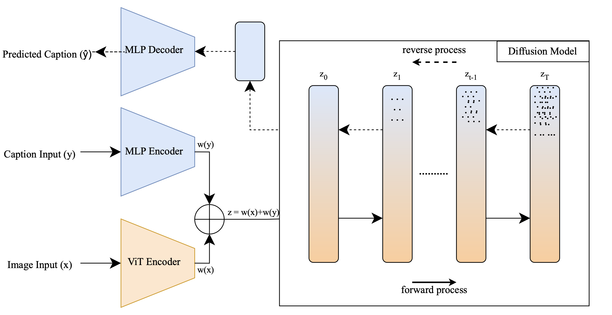

<p align = "center">

</p>
<p align = "center">
DIMGSEQ: Image to Sequence Emotion Generation with Diffusion Models using ArtELingo.
</p>


## Setup:
The code is based on PyTorch and HuggingFace `transformers`.
```bash 
pip install -r requirements.txt 
```

## Datasets
Prepare datasets and put them under the `datasets` folder. Take `datasets/CommonsenseConversation/train.jsonl` as an example. We use four datasets in our paper.

## DiffuSeq Training
```bash
cd scripts
bash train.sh
```
python -m torch.distributed.launch --nproc_per_node=8 --master_port=12233 --use_env run_train.py --diff_steps 1000 --lr 0.0001 --learning_steps 232184 --save_interval 64 --seed 102 --noise_schedule sqrt --hidden_dim 768 --bsz 512 --dataset artelingo --data_dir 'dataset/wiki_art_paintings/english/train/artemis_preprocessed.csv' --vocab bert --seq_len 64 --schedule_sampler lossaware --notes artelingo
```

## Evaluation & MBR
```bash
cd scripts
python eval_seq2seq.py --folder ../output/ArtELingo --mbr
```
Note: if you want to use this evaluation script for output files from other models, please make sure the same line from these output files refers to the same piece of data. Otherwise the diversity score could be incorrect.
